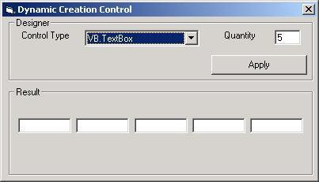

## Dynamic Creation Control in RunTime

### Description

This program is useful, when you need create control and don´t know how many element you have.

Also show how you can add and remove control in runtime.

Also, you can create a control deal of you need it. For instance, when you need load information, but don´t know how many control you must paint.
 
### More Info
 

             |
---                |---
**Submitted On**   |2002-01-09 09:32:34
**By**             |[Omar Vivas](https://github.com/Planet-Source-Code/PSCIndex/blob/master/ByAuthor/omar-vivas.md)
**Level**          |Intermediate
**User Rating**    |4.3 (17 globes from 4 users)
**Compatibility**  |VB 4\.0 \(16\-bit\), VB 4\.0 \(32\-bit\), VB 5\.0, VB 6\.0
**Category**       |[Miscellaneous](https://github.com/Planet-Source-Code/PSCIndex/blob/master/ByCategory/miscellaneous__1-1.md)
**World**          |[Visual Basic](https://github.com/Planet-Source-Code/PSCIndex/blob/master/ByWorld/visual-basic.md)
**Archive File**   |[Dynamic\_Cr47393192002\.zip](https://github.com/Planet-Source-Code/omar-vivas-dynamic-creation-control-in-runtime__1-30611/archive/master.zip)

